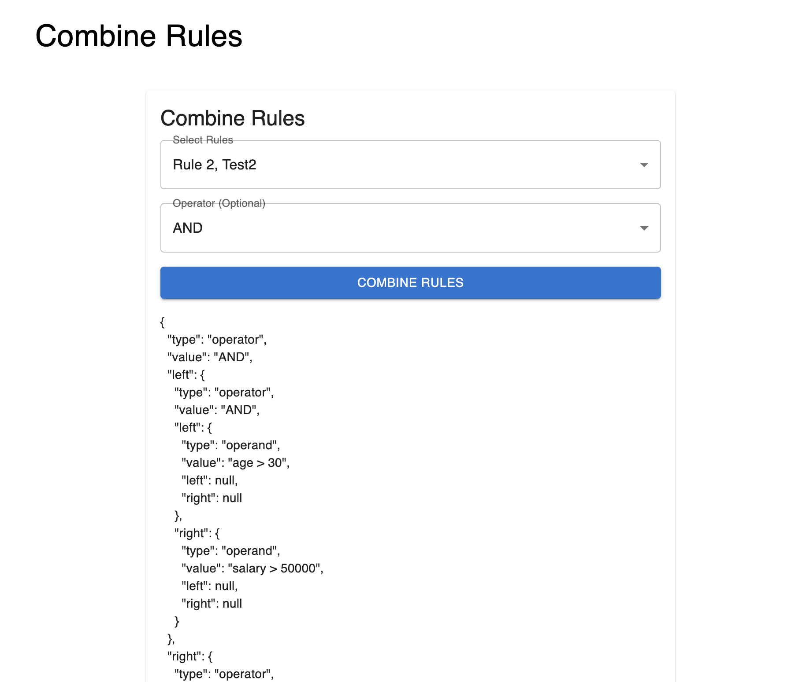

# Rule Engine with Abstract Syntax Tree (AST) 🌳

## Table of Contents
- [Overview](#overview)
- [Screenshots](#screenshots)
- [Technologies Used](#technologies-used)
- [How to Start the Project](#how-to-start-the-project)
- [Features and Functionality](#features-and-functionality)
- [Bonus Features Implemented](#bonus-features-implemented)
- [Future Work](#future-work)
- [API Documentation](#api-documentation)
- [Project Structure](#project-structure)

## Overview
This project is a three-tier rule engine application designed to manage and evaluate dynamic business rules. The rules are represented using an Abstract Syntax Tree (AST), enabling flexibility in creating, modifying, and combining rules. The system provides a user-friendly frontend interface built with React and Material-UI, and a robust backend using Node.js, Express, and MongoDB.

This rule engine can be used in decision-making systems like eligibility checks, access control, or personalized offers based on user attributes such as age, department, income, and experience.

## Screenshots
*(Add screenshots here to show how the Create, Modify, Combine, and Evaluate Rule forms look in the UI.)*

### Create Rule Form:


### Modify Rule Form:


### Combine Rules Form:


### Evaluate Rule Form:


## Technologies Used

### Frontend:
- **React.js** – For building the user interface
- **Material-UI** – For styling and responsive components
- **Axios** – For making API calls to the backend

### Backend:
- **Node.js and Express.js** – For API and business logic
- **MongoDB (via Mongoose)** – For storing rules and metadata

### Other Tools:
- **AST (Abstract Syntax Tree)** – For parsing and processing rule logic
- **ESLint** – For maintaining code quality
- **Git** – For version control

## How to Start the Project

### Prerequisites
- Node.js (v16 or above)
- MongoDB (local or cloud-based like MongoDB Atlas)
- npm (comes with Node.js installation)

### 1. Clone the Repository
```bash
git clone <repository_url>
cd rule-engine-ast
```

### 2. Install Backend Dependencies
```bash
cd server
npm install
```

### 3. Install Frontend Dependencies
```bash
cd client
npm install
```

### 4. Configure MongoDB
If using MongoDB Atlas, add your connection string to the backend server/.env file:
```bash
MONGODB_URI=mongodb+srv://<username>:<password>@cluster0.mongodb.net/mydatabase?retryWrites=true&w=majority
```
If using local MongoDB, ensure it is running on port 27017.

### 5. Start the Backend Server
```bash
cd server
node server.js
```

### 6. Start the Frontend
```bash
cd client
npm start
```

### 7. Access the Application
Open your browser and navigate to:
```
http://localhost:3000
```

## Features and Functionality

### 1. Create Rule
- **Functionality**: Allows users to create rules with conditions (e.g., (age > 30 AND salary > 50000))
- **AST Representation**: The rule is stored as an Abstract Syntax Tree in MongoDB
- **Validation**: Checks if all attributes used in the rule belong to the predefined catalog

### 2. Modify Rule
- **Functionality**: Users can update operators and operands of an existing rule
- **Dropdown for Operators**: Users can select AND/OR operators
- **Immediate Feedback**: The modified rule is displayed in the frontend upon successful update
- **Validation**: Ensures all fields are filled before submission

### 3. Combine Rules
- **Functionality**: Combines multiple rules using logical operators (AND/OR)
- **Most Frequent Operator Heuristic**: Automatically selects the most common operator if not provided by the user
- **Visual Feedback**: Displays the combined rule as a JSON AST

### 4. Evaluate Rule
- **Functionality**: Evaluates a rule based on dynamic user input (e.g., { "age": 35, "salary": 60000 })
- **Result**: Displays True/False based on whether the input meets the rule conditions

### Error Handling and Validations
- **Invalid Rules**: Detects and reports issues like missing operators or mismatched parentheses
- **Attribute Validation**: Ensures only valid attributes (like age or department) are used in the rules

## Bonus Features Implemented

### Error Handling for Invalid Rules:
- Detects missing operators and mismatched parentheses during rule parsing

### Attribute Validation Against Catalog:
- Ensures that only valid attributes (like age, salary) are used when creating or modifying rules

### Modification of Existing Rules:
- Users can modify operators and operands dynamically using the Modify Rule form

### Support for User-defined Functions:
- The backend can support functions like isSenior(age) to add advanced logic

## Future Work

### Role-based Access Control:
- Add user roles (Admin, User) to control access to rule creation and modification

### Rule Usage Analytics:
- Track how often rules are evaluated and provide insights

### UI Improvements:
- Add drag-and-drop functionality for creating complex rules visually

### Deploy to Cloud:
- Host the application on Heroku or AWS and use MongoDB Atlas for cloud storage

## API Documentation

### 1. Create Rule
**Endpoint**: `POST /api/rules/create`

**Request**:
```json
{
  "name": "AgeRule",
  "ruleString": "(age > 30 AND salary > 50000)"
}
```

**Response**:
```json
{
  "_id": "652f1e20e5d9b83234eaf23c",
  "name": "AgeRule",
  "ruleAST": { ... }
}
```

### 2. Modify Rule
**Endpoint**: `PUT /api/rules/modify`

**Request**:
```json
{
  "ruleId": "652f1e20e5d9b83234eaf23c",
  "updates": {
    "operator": "OR",
    "left": "age > 35",
    "right": "salary > 60000"
  }
}
```

**Response**:
```json
{
  "message": "Rule modified successfully",
  "rule": { ... }
}
```

### 3. Combine Rules
**Endpoint**: `POST /api/rules/combine`

**Request**:
```json
{
  "ruleIds": ["652f1e20e5d9b83234eaf23c", "652f1e20e5d9b83234eaf23e"],
  "operator": "AND"
}
```

**Response**:
```json
{
  "combinedAST": { ... }
}
```

## Project Structure
```bash
/client         # Frontend React Application
  /src
    /components # Reusable components (e.g., RuleDropdown)
    /pages      # Create, Modify, Combine forms
    /api.js     # Axios API functions
    App.js      # Main entry point with routing

/server         # Backend Node.js Application
  /controllers  # API controllers (create, modify, combine, evaluate)
  /models       # Mongoose models (Rule)
  /routes       # Express routes
  /services     # AST logic and validation services
  server.js     # Backend entry point
```

## Conclusion
This project demonstrates a complete rule engine with AST, supporting dynamic rule creation, modification, combination, and evaluation. With robust error handling, validation, and user-defined functions, this system is both powerful and flexible for real-world decision-making.

Let me know if you need any further modifications or additions! 🚀
